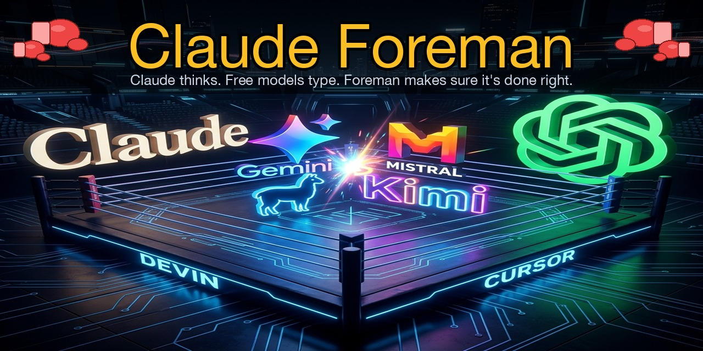
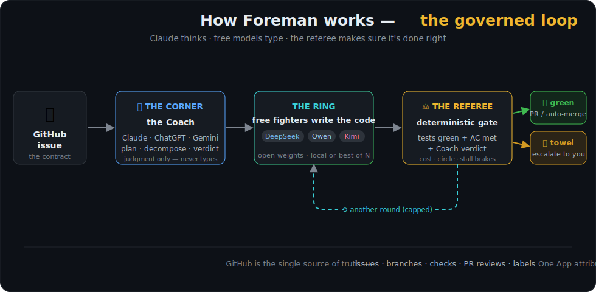
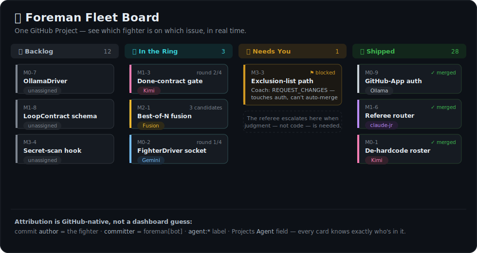

<p align="center">
  
</p>

<p align="center">
  
  <a href="https://github.com/hayssamhob/claude-foreman/issues"></a>
  <a href="https://github.com/hayssamhob/claude-foreman/issues?q=is%3Aissue+label%3A%22good+first+issue%22"></a>
  
  
</p>

# Claude Foreman

> The Coach thinks. open weight models type. Foreman makes sure it's done right.

An autonomous coding supervisor that routes GitHub issues to free AI models (Kimi, Gemini) running in Windsurf, Antigravity, or Cursor — while the Coach handles decomposition, review, and escalation.

<p align="center">
  
</p>

**Manage whole projects on GitHub** — the board shows which fighter is on which issue, live:

<p align="center">
  
</p>

## Requirements

- **macOS** (dispatch uses `windsurf chat` CLI + AppleScript fallback)
- **Python 3.10+**
- **[`gh` CLI](https://cli.github.com/)** — authenticated (`gh auth login`)
- **Windsurf** and/or **Antigravity** installed in `/Applications/`
- **Claude Code** with the `/claude-foreman` skill installed (see below)

## Install

```bash
git clone https://github.com/DepolluteNow/claude-foreman.git
cd claude-foreman
pip install -e .
foreman --help   # verify
```

## Install the Claude Code Skill

The `/claude-foreman` skill is what Claude uses to drive the `foreman` CLI.
Install it globally so it's available in every project:

```bash
mkdir -p ~/.claude/skills/claude-foreman
cp .claude/skills/claude-foreman/SKILL.md ~/.claude/skills/claude-foreman/SKILL.md
```

Then in any Claude Code session, type `/claude-foreman` to invoke it.

## Install the VS Code Bridge Extension (optional but recommended)

The foreman-bridge extension gives Claude live IDE state (branch, diagnostics, file saves).
Without it, pre-flight checks are skipped and timeout diagnosis is limited.

```bash
cd extension/foreman-bridge
npm install
npm run build
# Then install the .vsix in Windsurf / VS Code:
# Extensions → ··· → Install from VSIX → pick out/foreman-bridge-*.vsix
```

## Devin Desktop LLM Gateway (Proxy)

`claude-foreman` now includes a built-in proxy that turns the **Devin Desktop App** into a local, OpenAI-compatible API. This allows you to use Devin's powerful open weight models (like `kimi-k2.7`, `glm-5.2`, `swe-1.6`) directly inside Hermes, Antigravity, or any other API client—without API rate limits!

To start the proxy:
```bash
npm run devin-proxy
```
The server will run on `http://localhost:3001/v1`. 

To configure Hermes to use it:
1. Run `hermes model`
2. Select `custom (direct API)`
3. Set the base URL to `http://localhost:3001/v1`
4. Pick your desired model from the menu.

## Quick Start

Once installed, open Claude Code in any project and run:

```
/claude-foreman owner/repo#42
```

Claude will fetch the issue, create a branch, dispatch to Windsurf, wait for a commit, verify the diff and closing reference, and optionally create a PR — all automatically.

Or dispatch multiple issues while you sleep:

```
/claude-foreman queue owner/repo#42 owner/repo#43 owner/repo#44
```

## How It Works

Every dispatch cycle is 3 tool calls and costs ~1,300 Claude tokens:

| Phase | What happens | Cost |
|-------|-------------|------|
| **Phase 1** `dispatch-issue` | Fetch issue, create branch, dirty-check, open IDE, send prompt | ~400 tokens |
| **Phase 2** `wait` | Poll `git log` until new commit detected; auto-create PR | ~400 tokens |
| **Phase 3** `verify` | Diff summary, closing-ref check, optional test run | ~500 tokens |

The open weight models (Kimi, Gemini) does all the actual coding — zero tokens for that part.

## Workflows

### Dispatch an existing issue
```bash
/claude-foreman owner/repo#42
```

### Create an issue and dispatch it in one shot
```bash
/claude-foreman create owner/repo "Add dark mode toggle"
```
Claude writes the spec, creates the issue on GitHub, and dispatches immediately.

### Queue multiple issues end-to-end
```bash
/claude-foreman queue owner/repo#42 owner/repo#43 owner/repo#44
```

### Dispatch a task file (no GitHub issue needed)
```bash
/claude-foreman .tasks/010-auth-flow.md
```

## Safety Guards

Every dispatch automatically enforces:

- **Dirty worktree check** — refuses to dispatch if uncommitted changes exist
- **Pre-flight** — verifies IDE is on the correct branch (no wrong-window dispatch)
- **HEAD-hash wait** — `foreman wait` compares git HEAD, not `--since` (no false positives)
- **Closing reference check** — `foreman verify` confirms commit contains `closes #N`
- **Timeout diagnosis** — on timeout, takes a screenshot + queries bridge `/health`

## Architecture

```
foreman/
├── cli.py                  # foreman CLI (11 commands)
├── github.py               # gh CLI wrappers (fetch, branch, PR, comment)
├── bridge_interface.py     # Abstract IDE bridge interface
├── config.py               # IDE registry, model catalog
├── models.py               # Model routing heuristics
├── drivers/
│   ├── cascade_bridge.py   # Windsurf (windsurf chat CLI + AppleScript fallback)
│   ├── gemini_bridge.py    # Antigravity
│   ├── cursor_bridge.py    # Cursor
│   └── applescript/        # macOS automation scripts
├── ring/
│   ├── loop.py             # Supervisor state machine
│   ├── router.py           # Task complexity classifier
│   ├── watcher.py          # git-based completion detector
│   ├── state.py            # Session persistence (~/.claude/foreman-state.json)
│   ├── takeover.py         # Circle detection (same-region / same-error / net-zero)
│   └── learnings.py        # Adaptive routing from past sessions
└── comms/
    └── telegram.py         # Escalation message formatting

extension/
└── foreman-bridge/         # VS Code extension — exposes IDE state over HTTP
    └── src/extension.ts    # /git, /health, /files, /diagnostics endpoints
```

## Token Budget

| Workflow | Tool calls | Est. tokens |
|----------|-----------|-------------|
| Dispatch issue + wait + verify | 3 | ~1,300 |
| Create-and-dispatch + wait + verify | 3 | ~1,400 |
| Queue (N issues) | 1 | ~500 + N×200 |
| Task file (preflight + dispatch + wait + verify) | 4 | ~1,600 |

At $15/M tokens (Claude Sonnet), dispatching 10 issues costs under $0.20 in Claude tokens.
The open weight models (Kimi, Gemini) write all the code at $0.

## Self-Improvement

After each session, Foreman runs a retrospective:
- Measures first-try rate per model per task type
- Updates routing weights (adaptive routing)
- Guards against regressions — reverts routing changes if success rate drops
- Persists to `~/.claude/foreman-learnings.json`

## Tests

```bash
python -m pytest tests/foreman/ -v   # 115 tests, <1s
```

CI runs on Python 3.10, 3.11, 3.12, and 3.13.

## License

MIT — Built by [Depollute Now!](https://depollutenow.com)
